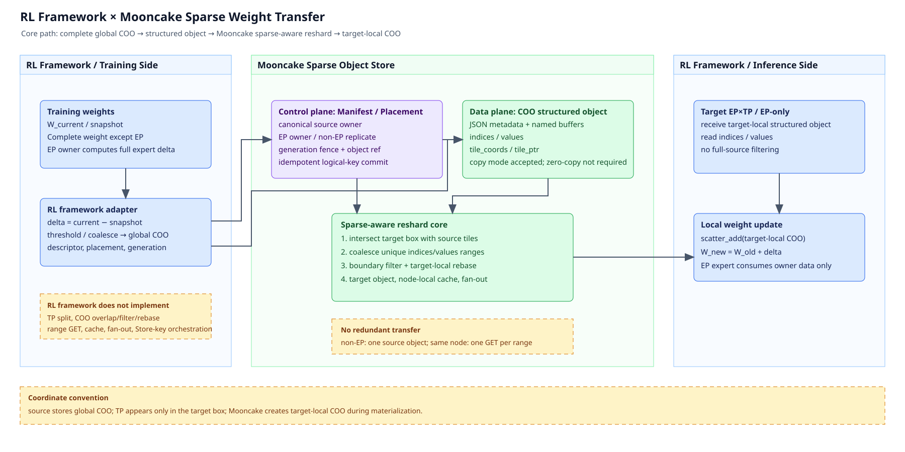

# [RFC] COO-format sparse weight transfer for RL

## Status

- **Status:** Draft
- **Modules:** Mooncake Store, Mooncake Reshard, Mooncake RL
- **Type:** New feature / Performance improvement

## Changes proposed

During RL training, MoE weight updates should be transferred as sparse deltas instead of
complete dense weights. The training side computes `delta = W_current - W_snapshot`, applies
a threshold, and encodes the result as a COO sparse tensor. One update is committed as one
global COO source object using a Mooncake structured object with named buffers for `indices`,
`values`, and a compact tile index.

The inference topology may use EP and TP differently from the training topology. Mooncake
must therefore materialize the source object into target-local COO objects according to target
logical boxes. The Store read path invokes a `mooncake.reshard.sparse` planner, reads only the
COO entry ranges intersecting each target box, performs boundary filtering and global-to-local
coordinate rebasing, and publishes target-local structured objects. The inference side only
applies the result with `scatter_add`.

The RL adapter does not call a public `reshard` API. The public entry points remain
Store-oriented operations such as `put_sparse_object()` and `read_sparse_objects()`; placement
routing, COO range planning, duplicate-read suppression, caching, and target object
materialization are Mooncake responsibilities.

## Motivation

### RL produces sparse weight deltas

RL training and inference usually run in separate resource pools. A training job periodically
publishes model updates to inference. Sending the complete model weight for every update makes
the communication volume proportional to the model size and can turn the update into the
dominant synchronization point.

For MoE weights, an update often changes only a fraction of the elements. The natural wire
representation is therefore:

```text
delta = W_current - W_snapshot
nonzero(delta) -> COO(indices, values)
```

The COO is the content of the source update object, not a temporary format that every target
has to rediscover. `indices` stores coordinates in the complete tensor coordinate space and
`values` stores the corresponding delta values. Both arrays use the same entry order so that
the Store can read them with aligned axis-0 ranges.

### Training and inference layouts differ

The source-side rule is defined per logical weight object. For an EP expert, one source EP owner
computes the complete expert delta. For a non-EP/shared weight, one source owner produces one
complete delta, even when the weight is visible on multiple training ranks. The inference side
may use a different EP/TP topology, so Mooncake routes and slices that one source object at the
target:

| Scenario | Source semantics | Target semantics |
| --- | --- | --- |
| EP expert | One source EP owner computes one complete expert delta | Route only to the corresponding target EP; split by TP inside that EP |
| non-EP/shared weight | One complete delta is produced | All target EP replicas reuse the same source object and take their TP boxes |
| EP-only | One complete expert or shared-weight object | The target logical box is the complete tensor; no TP split |

This rules out two tempting implementations. The source cannot create one COO object per
target replica, and each target cannot download the complete source object and filter it
locally. The required abstraction is one complete source object followed by target-side
sparse-aware reshard.

### Current bottlenecks

Treating `indices` and `values` as ordinary Python objects introduces object-level
serialization and deserialization. It also encourages separate Store keys for metadata,
indices, and values. More importantly, a non-EP source object can be downloaded repeatedly by
each EP×TP target even though all replicas need overlapping ranges. A centralized storage
endpoint then becomes a bandwidth bottleneck.

This RFC is driven by three measurable requirements:

1. **Reduce serialization overhead.** Use a named-buffer structured object. A copy inside the
   structured-object implementation is acceptable for the first version; zero-copy is not a
   protocol prerequisite.
2. **Avoid redundant transfer.** A non-EP update has one source object. On one node, the same
   `(source_ref, generation, range)` is physically read once and then fanned out to local
   targets.
3. **Preserve transport efficiency.** The planner reads only the compact tile index and
   requests the `indices`/`values` ranges covered by a target box. It must not materialize the
   complete COO payload for every target.

## Goals

1. Represent one sparse update with a generic COO structured-object contract that is not tied
   to EP, TP, or a particular RL framework.
2. Support EP expert, non-EP/shared weight, and EP-only target layouts.
3. Put sparse-aware logical planning in `mooncake-reshard`; let the Store executor perform
   reads, filtering, rebasing, and target-object publication.
4. Keep the RL training/inference adapter thin: it computes the delta, encodes global COO,
   and supplies descriptors and generations.
5. Preserve de-duplication as source and target counts grow: no repeated source computation or
   PUT, and no repeated physical GET of the same range on one node.

## Non-goals

1. Changing the continuous-byte-region semantics of the existing dense model-weight reshard
   planner.
2. Requiring zero-copy in the first implementation. The structured-object copy path is an
   accepted baseline.
3. Inferring layer, expert, TP dimension, or other model semantics inside Mooncake. Framework
   adapters must provide these facts in descriptors and placement policies.
4. Defining the quantization algorithm for mismatched source/target dtypes such as BF16 and
   FP8. That is a separate protocol decision.
5. Making a full source COO GET the normal fallback. Unsupported N-D indexes or explicit dense
   fallback must be visible in metrics.

## Design

### 1. Data model: one global COO structured object

The source update uses Mooncake structured-object metadata plus named buffers:

```text
metadata
  schema = mooncake.sparse_object
  tensor_id / global_shape / global_offset / local_shape
  coordinate_space = global
  base_generation / delta_generation
  source_placement / tile_shape / member specifications

buffers
  indices     [nnz, ndim]
  values      [nnz]
  tile_coords [num_tiles, ndim]
  tile_ptr    [num_tiles + 1]
```

COO entries are sorted by `(tile coordinate, element coordinate)`. The range
`tile_ptr[i]:tile_ptr[i+1]` contains all entries in non-empty tile `i`. `indices` and
`values` use the same entry offsets, so a Store range read can select both members with one
logical range.

The copy path adds a memory copy but does not change de-duplication semantics. The first
version removes Python/pickle object serialization, full source COO GETs, and repeated source
PUTs. Zero-copy can be added later without changing this object contract.

### 2. Implementation boundary

#### `mooncake.reshard.sparse`: address-free logical planner

Add an independent namespace under
`mooncake-reshard/python/mooncake/reshard/sparse/`:

```text
contracts.py   source/target descriptors, COO index, plan, and region
placement.py   owner/replicate policies over named placement axes
geometry.py    box intersection, tile overlap, and coordinate rebasing geometry
planner.py     tile lookup, range union/coalescing, and batch planning
```

The planner accepts descriptors, placement, target boxes, and compact tile indexes. It returns
a `SparseObjectPlan`. It does not import Store, issue RPCs, allocate buffers, or materialize
complete COO payloads.

#### Structured-object Store executor

The Store layer owns:

- COO validation, sorting, tile-index construction, and structured-object commit;
- manifest, generation fencing, source-owner admission, and idempotent logical-key commit;
- index-only GET and aligned `indices`/`values` range GET;
- boundary filtering, target-local rebasing, and target-object publication;
- source-range cache, node-local cache, batch fan-out, and physical-node routing.

The initial contract can be tested without a running service. In production, the address-free
planner moves to `mooncake-reshard`; the Store API remains the only entry point used by the RL
adapter.

### 3. Sparse-aware reshard read path

`read_sparse_objects(manifest, targets)` follows this sequence:

1. **Placement filtering.** An EP expert uses `owner(ep -> ep)`, so only the corresponding
   target EP can read its source object. A non-EP weight uses `replicate(ep)`, so all target
   EPs reference the same source object. This step reads the manifest only.
2. **Global box intersection.** Intersect the source box and target box. TP is represented by
   the target `global_offset` and `local_shape`; an EP-only target covers the complete tensor.
3. **Compact-index read.** Read `tile_coords` and `tile_ptr` once per source object and cache
   them at the worker or node level.
4. **Entry-range planning.** Use the compact index to find tiles intersecting the overlap.
   Return `[start, end)` ranges and an `exact_coordinate_filter` flag. Before issuing reads,
   union or coalesce requests by `(source_ref, generation, node, range)`.
5. **Selective COO read.** Read `indices[start:end]` and `values[start:end]` for each unique
   range. Unmatched tiles are never materialized.
6. **Boundary filtering.** A tile fully inside the overlap needs no coordinate test. A boundary
   tile is filtered with `begin[d] <= indices[i,d] < end[d]`.
7. **Target-local rebase.** Subtract the target offset from the selected global coordinates,
   then publish a target-local structured object with `apply = scatter_add`.
8. **Runtime apply.** The inference side reads the target-local COO and applies
   `W_new = W_old + delta`.

### 4. Efficient planning from the COO layout

The planner queries the compact tile index, not the complete `indices`/`values` payload. The
two-dimensional sparse-weight hot path is:

```text
COO commit
  -> sort by (tile_row, tile_col, row, col)
  -> persist tile_coords + tile_ptr
  -> build row-group and column-group secondary indexes

target box
  -> convert element bounds to tile bounds
  -> binary-search row groups or column groups
  -> select only matching tile positions
  -> map positions to entry ranges
  -> read indices and values with the same ranges
```

Row-oriented targets use row groups; column-oriented targets use column groups. For a box that
covers a broad area in both dimensions, select the direction with fewer outer candidate groups,
then binary-search the other coordinate. Sort matching entry offsets before coalescing so
adjacent tiles do not create separate GETs.

If a source object has `T` non-empty tiles, `R` tile rows, `C` tile columns, and a target hits
`K` tiles, building the two secondary indexes costs `O(T)` on first use. The hot query does
not scan `nnz`:

```text
row path:    O(log R + selected row groups × log C + K)
column path: O(log C + selected column groups × log R + K)
```

The planner returns ranges and boundary-filter metadata; it never reads the payload. The
initial implementation may lazily build row/column indexes. Production can persist or
precompute the compact indexes at source commit and plan a complete target batch in one call.

### 5. No-redundant-transfer constraints

#### Source side

Non-EP weights may be visible on several training EP ranks, but only one canonical source owner
may perform the expensive work:

```text
logical_key = (tensor_id, base_generation, delta_generation, placement_policy)
```

The owner is admitted before computing COO and issuing PUT. Other ranks do not compute the same
update. Commit is idempotent for the logical key, so retries cannot publish multiple source
objects.

#### Target side

For non-EP EP2×TP2, both EP replicas reuse the same two TP ranges:

```text
EP0/TP0 ─┐                 EP0/TP1 ─┐
EP1/TP0 ─┘  source range 0  EP1/TP1 ─┘  source range 1
```

Mooncake plans the complete target batch, de-duplicates by source reference, generation,
physical node, and range, then fans the result out from the node-local cache. A range is read
once per node, not once per EP×TP target. The final transfer to distinct physical target nodes
is the real cost of target replicas and is not a repeated source upload.

At minimum, acceptance metrics must show:

```text
non_ep_source_object_count == 1
full_indices_values_get_count == 0
unique_range_gets == union(required_ranges_per_node)
```

### 6. Public API and adapter boundary

The RL framework supplies complete-delta global COO and a placement descriptor:

```python
source = mooncake.put_sparse_object(
    tensor_id=name,
    global_shape=tuple(weight.shape),
    indices=global_indices,
    values=delta_values,
    source_placement=source_placement,
    generation=(base_generation, delta_generation),
)

target_objects = mooncake.read_sparse_objects(manifest, targets)
```

The adapter does not implement TP splitting, EP/TP routing, overlap/filter/rebase, range GETs,
cache, fan-out, or physical Store-key orchestration. After receiving a target-local object, the
runtime only applies `scatter_add`.

### 7. Architecture diagram

The two endpoints are deliberately labeled as the RL framework training side and inference
side rather than a specific framework implementation. The Mooncake area separates the control
plane, structured-object data plane, and sparse-aware reshard execution path.



[Editable Draw.io XML](sparse_weight_architecture.drawio) · [SVG preview](sparse_weight_architecture.svg)

The solid arrows are the required path. Yellow dashed boxes state boundaries and transfer
constraints:

```text
RL training side
  -> global COO
  -> COO structured object
  -> sparse-aware reshard
  -> target-local COO
  -> RL inference side scatter_add
```

## Alternatives considered

### Read the complete source object at every target

This is simple, but every EP×TP target downloads the same source payload and filters it only
after the redundant transfer. It fails both the no-redundant-transfer requirement and the
bandwidth target. The RFC moves selection into Store-side tile planning and range reads.

### Pre-split COO at the source by target TP

This couples the training representation to the inference topology. A topology change then
requires new source objects and new PUTs; non-EP weights also acquire several equivalent source
objects. The RFC keeps one global source object and interprets TP only at the target.

### Why sparse-aware reshard is separate from dense reshard

This RFC does not introduce a second transport subsystem. The sparse path should reuse the
existing Store mechanisms for placement resolution, range reads, connection management, cache,
batch scheduling, and fan-out. What must be separate is the logical reshard planner, because the
existing dense planner and a COO sparse object have different contracts:

1. **Different address model.** Dense reshard maps a target shard to a continuous byte interval
   in a source shard. A COO object is addressed by logical coordinates. Its `indices` and
   `values` arrays contain irregular entries, while `tile_coords` and `tile_ptr` describe the
   mapping from coordinate tiles to entry ranges. A target therefore needs tile overlap and
   coordinate filtering, not only byte-offset arithmetic.
2. **Different source semantics.** Dense reshard normally operates on source shards that are
   already aligned with a partitioned weight. This scenario requires one complete source object
   for every non-EP/shared weight and one complete expert object per EP owner. The target EP/TP
   layout is selected only at read time. Owner-versus-replica admission and source-reference
   reuse are sparse-object planning decisions.
3. **Different target operation.** Dense reshard copies or overwrites a target region. A sparse
   delta must be filtered at tile boundaries, rebased from global to target-local coordinates,
   and applied with `scatter_add`. These operations cannot be represented by a dense byte-region
   plan without hiding sparse semantics in the executor.
4. **Different efficiency objective.** A dense range plan cannot identify which COO entries are
   zero or which entries fall outside a target box. Reusing it would cause every target to read
   the complete source COO payload and filter locally, which violates the no-redundant-transfer
   requirement. The sparse planner reads the compact tile index first, selects only intersecting
   entry ranges, and coalesces duplicate `(source_ref, generation, node, range)` requests.
5. **Different evolution boundary.** Adding sparse branches to the dense planner would couple
   continuous-region logic, sparse indexing, and `scatter_add` semantics in one API and could
   change existing dense behavior. A `sparse` namespace under the same `mooncake-reshard`
   module keeps the dense contract stable while allowing future sparse layouts or formats to
   share common geometry and scheduling utilities.

Consequently, the new component is an address-free sparse planner that returns a
`SparseObjectPlan`; it does not issue RPCs or replace the Store data path. The Store executor
consumes that plan and continues to use Mooncake's existing transport and caching primitives.

## Rollout plan

1. **Contract implementation.** Implement the structured-object schema, placement, tile
   indexes, range reads, and target-local rebasing as an executable contract.
2. **Planner extraction.** Move Store-independent contracts, geometry, placement, and planner
   code into `mooncake-reshard/python/mooncake/reshard/sparse/`.
3. **Store integration.** Add index-only GET, batch range union, node-local cache, fan-out,
   and idempotent source commit to the structured-object Store service.
4. **RL adapter integration.** Keep only complete delta -> global COO -> Store API in the
   framework adapter; Mooncake returns admission and target object references.
5. **Benchmark and fallback.** Compare dense full transfer, complete-source GET, and
   sparse-aware range GET. Report source PUT, range read, fan-out, and target-object bytes
   separately. Unsupported dtype or N-D layouts must use an explicit, instrumented fallback.

## Validation

Validation must cover two-dimensional row/column tile lookup, N-D fallback, named-axis owner
mapping, non-EP source-owner admission, EP+TP, EP-only, aligned COO range reads, boundary
filtering, target-local rebasing, and source-range de-duplication. The non-EP EP2×TP2 case must
produce one source object, two unique TP-range GETs, and no complete source COO GET.

## Open questions

1. Should row/column secondary indexes be persisted at source commit, or lazily built and
   cached by workers? This needs a benchmark across realistic tile counts and manifest sizes.
2. When BF16 deltas update FP8 inference weights, should quantization happen at the source
   full-tensor stage or during target materialization? This must remain separate from the first
   COO range contract.
3. Should duplicate COO coordinates preserve `scatter_add` semantics, or should the Store
   executor coalesce them? The answer must match the training-side delta-generation rule.
4. Should Mooncake add a dedicated multi-level index for 3-D and higher-dimensional sparse
   objects? Until then, the generic planner needs a bounded fallback.

## AI assistance disclosure

The research, analysis, and technical design in this RFC were completed by the RFC author. AI
tools were used only to assist with wording, formatting, and validation. The Mooncake and RL
framework maintainers still need to confirm the business semantics, module ownership, and
acceptance criteria during RFC review.
